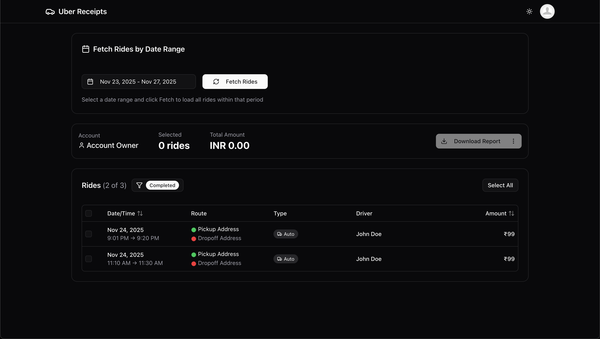

<h1 align="center">
  <br>
  <a href="https://uber-rides-receipt.vercel.app/"></a>
  <br>
  Uber Rides Receipt
  <br>
</h1>

<h4 align="center">A small TypeScript + Vite web app for viewing and exporting Uber ride data and receipts.</h4>

<p align="center">
  <a href="#key-features">Key Features</a> •
  <a href="#how-to-use">How To Use</a> •
  <a href="#credits">Credits</a> •
  <a href="#license">License</a>
</p>

## Key Features

* **View Rides**
  - Interactive table of rides with filtering and sorting
  - Filter by date range, vehicle type, and status
* **Date Range Picker**
  - Select custom date ranges to filter displayed rides
* **Selection Summary**
  - Quick summary & totals for chosen rides
  - Export selected rides to PDF
* **PDF Export**
  - Generate professional PDF receipts for your rides
  - Bulk export multiple receipts at once
* **Direct Uber API Integration**
  - Fetch real-time ride data from your Uber account
  - Uses secure session-based authentication

## How To Use

To clone and run this application, you'll need [Git](https://git-scm.com) and [Bun](https://bun.sh) installed on your computer. From your command line:

```bash
# Clone this repository
$ git clone https://github.com/kunalagra/uber-rides-receipt.git

# Go into the repository
$ cd uber-rides-receipt

# Install dependencies
$ bun install

# Run the app
$ bun run dev
```

> [!IMPORTANT]  
> **Authentication Setup**: The app requires your Uber session cookie to fetch ride data.
> 1. Log in to `riders.uber.com/trips` in your browser
> 2. Open Developer Tools → Network tab
> 3. Find any GraphQL request and copy the `cookie` header value
> 4. Paste it into the app's authentication modal when prompted

> [!NOTE]
> **Security Warning**: Your session cookie provides full access to your Uber account. Never share or commit this value. The cookie is stored only in your browser's memory during the session.

**Build & Preview**

```bash
$ bun run build
$ bun run preview
```

## Credits

This software uses the following open-source packages:

- [TypeScript](https://www.typescriptlang.org/)
- [React](https://react.dev/)
- [Vite](https://vitejs.dev/)
- [Bun](https://bun.sh/)
- [TanStack Router](https://tanstack.com/router)
- [TanStack Query](https://tanstack.com/query)
- [Tailwind CSS](https://tailwindcss.com/)
- [Base UI](https://base-ui.com/)

## License

AGPL-3