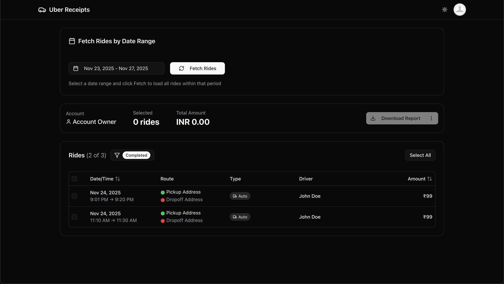

<h1 align="center">
  <br>
  <a href="https://uber-rides-receipt.vercel.app/"></a>
  <br>
  Uber/Rapido Rides Receipt
  <br>
</h1>

<h4 align="center">A small TypeScript + Vite web app for viewing and exporting ride data and receipts from multiple providers (Uber &amp; Rapido).</h4>

<p align="center">
  <a href="#key-features">Key Features</a> •
  <a href="#how-to-use">How To Use</a> •
  <a href="#credits">Credits</a> •
  <a href="#license">License</a>
</p>

## Key Features

* **Multiple Providers**
  - Switch between **Uber** and **Rapido** from the navbar
  - Each provider keeps its own independent session
  - Extensible provider registry — adding a new provider is a drop-in
* **View Rides**
  - Interactive table of rides with filtering and sorting
  - Filter by date range, vehicle type, and status
* **Date Range Picker**
  - Select custom date ranges to filter displayed rides
* **Selection Summary**
  - Quick summary & totals for chosen rides
  - Export selected rides to PDF / CSV
* **Exports**
  - Uber: bulk-merge official receipt PDFs, plus PDF/CSV summaries
  - Rapido: PDF & CSV summaries (Rapido does not issue per-ride invoices,
    so individual receipt PDFs are not available)
* **Direct API Integration**
  - Fetch real-time ride data straight from your account
  - Uses secure, browser-local session credentials

## Local Dev

To clone and run this application, you'll need [Git](https://git-scm.com) and [Bun](https://bun.sh) installed on your computer. From your command line:

```bash
# Clone this repository
$ git clone https://github.com/kunalagra/uber-rides-receipt.git

# Go into the repository
$ cd uber-rides-receipt

# Install dependencies
$ bun install

# Run the app
$ bun run dev
```

> [!IMPORTANT]
> **Authentication Setup**: Pick a provider in the navbar, then connect its account.
>
> **Uber** — needs your session cookie:
> 1. Log in to `riders.uber.com/trips` in your browser
> 2. Open Developer Tools → Network tab
> 3. Find any GraphQL request and copy the `cookie` header value
> 4. Paste it into the app's authentication modal when prompted
>
> **Rapido** — needs your Bearer token:
> 1. Log in to `m.rapido.bike/my-rides` in your browser
> 2. Open Developer Tools → Network tab and refresh
> 3. Click the `order` request and copy the `authorization` header value (the token after `Bearer`)
> 4. Paste it into the authentication modal — the customer ID and profile are read from the token

> [!NOTE]
> **Security Warning**: These credentials provide full access to your ride account. Never share or commit them. They are stored only in your browser (localStorage) and sent only to the respective provider's API via the app's server functions.

**Build & Preview**

```bash
$ bun run build
$ bun run preview
```

## Credits

This software uses the following open-source packages:

- [TypeScript](https://www.typescriptlang.org/)
- [React](https://react.dev/)
- [Vite](https://vitejs.dev/)
- [Bun](https://bun.sh/)
- [TanStack Router](https://tanstack.com/router)
- [TanStack Query](https://tanstack.com/query)
- [Tailwind CSS](https://tailwindcss.com/)
- [Base UI](https://base-ui.com/)

## License

AGPL-3